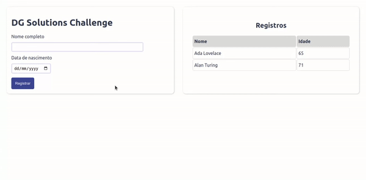

# DG Solutions Challenge

## 🖥 Sobre o projeto

O projeto é um app para inserção e visualização de dados de pessoas, onde são exibidos nome completo e idade da pessoa cadastrada no banco de dados.

---

## 🚀 Executando a aplicação

O projeto é dividido em duas parte:

1. [API para inserção e visualização dos dados.](https://github.com/matheuscarvalhoscm/dg-solutions-api)
2. Interface (disponível nesse repositório).

💡️ A interface precisa que o servidor (API) esteja sendo executado para renderizar os dados corretamente.

### **🎲️ Rodando a interface**

~~~
# clone o repositório
git clone https://github.com/matheuscarvalhoscm/dg-solutions-app.git

# acesse a pasta do servidor
cd dg-solutions-app

# instale as dependências
npm install

# execute a aplicação
npm run serve

# A aplicação inciará na porta:8080 - acesse http://localhost:8080
~~~
---
## 🛠️ Tecnologias
As seguintes tecnologias foram utilizadas na construção desse projeto:

---

## 📧 Contato

---

## 📚 References
- [Vue Docs](https://vuejs.org/guide/introduction.html)
- [Vue Test Utils Guide](https://v1.test-utils.vuejs.org/guides/#getting-started)
- [Stack Overflow](https://stackoverflow.com/)